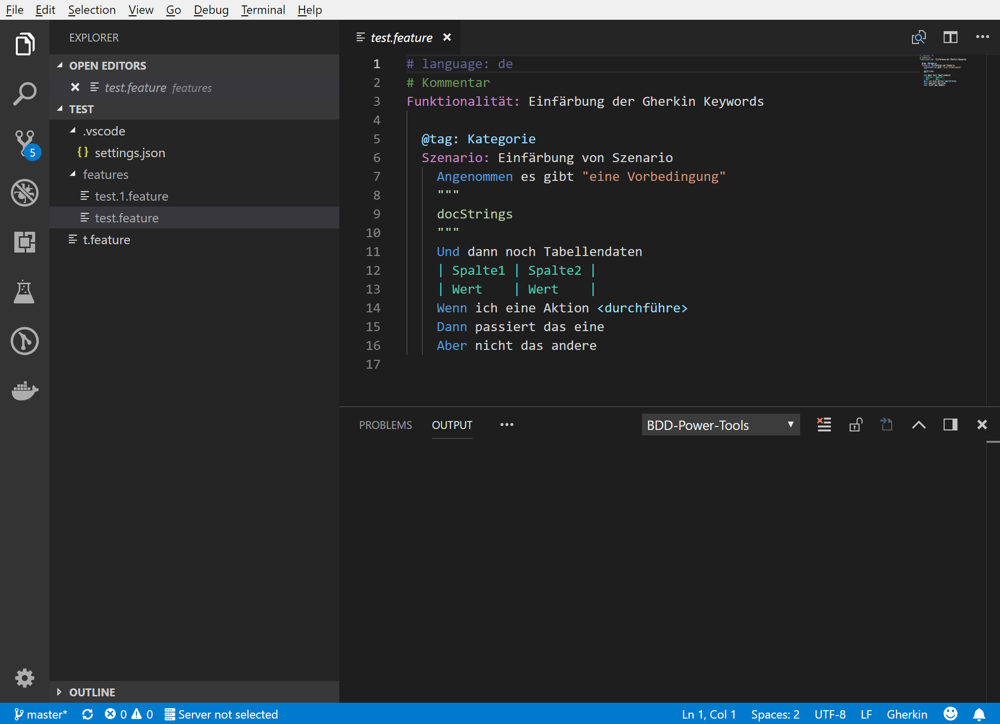

# BDD Power Tools

BDD Power Tools provide syntax highlighting and autocompletion for Gherkin scenarios.

## Features

Syntax highlighting provides nice colorization of Gherkin keywords in .feature files:

In addition autocomplete for gherkin keywords helps building syntactically correct scenarios.

> Note: The preview version currently supports only German language for step autocomplete. 

<!-- ## Extension Settings

Include if your extension adds any VS Code settings through the `contributes.configuration` extension point.

For example:

This extension contributes the following settings:

* `myExtension.enable`: enable/disable this extension
* `myExtension.thing`: set to `blah` to do something -->

## Issues

Use the [issue tracker](https://github.com/iteratec/bdd-power-tools/issues) to report and track any issues and feature requests.
